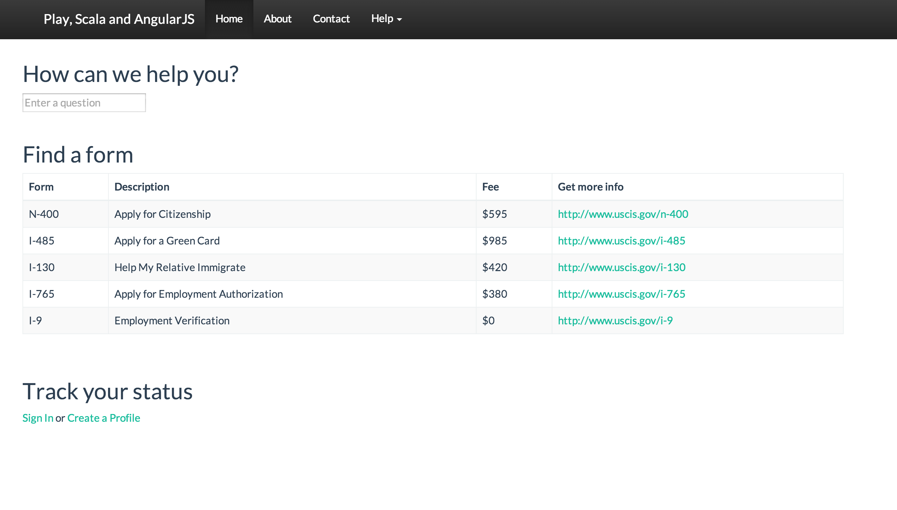
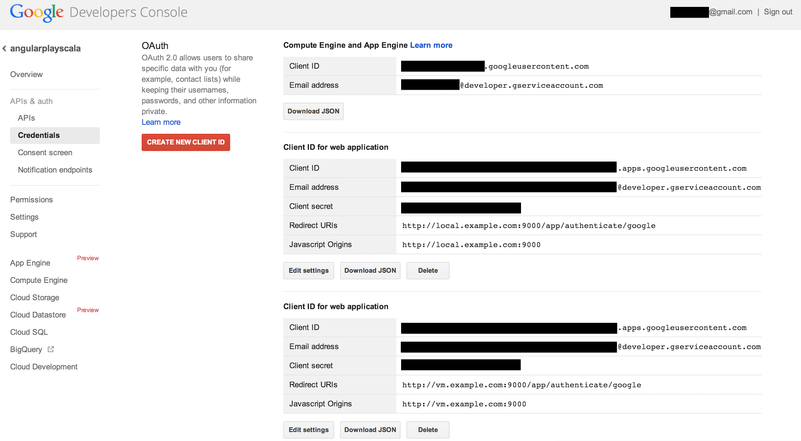
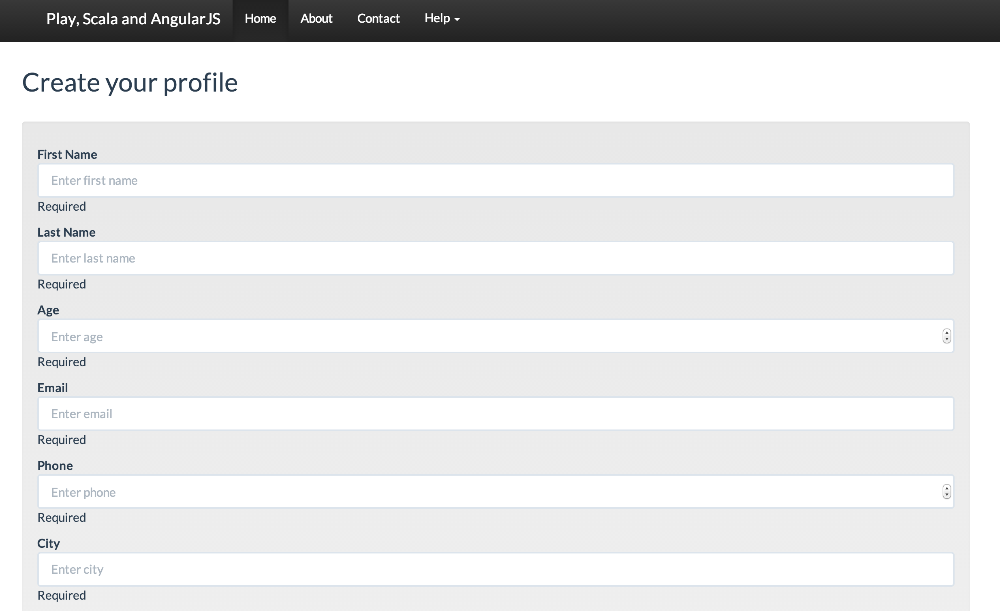
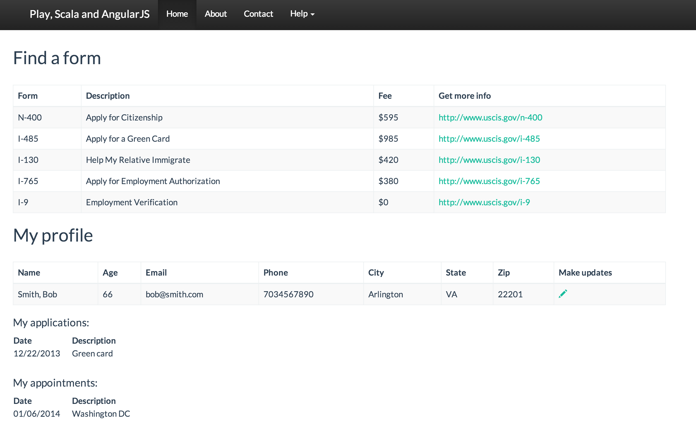

This is a demo of a RESTFul web app with 3rd party authentication and profile creation/edit. You can run and develop the app locally and run the provided mini CI/CD environment in a VM that pulls the code from this repository, tests and runs the app.

Technologies used:
* Play framework with Scala
  * Asynchronous JSON REST APIs
  * ReactiveMongo plugin for async MongoDB connections
  * SecureSocial plugin for authentication with Google
* AngularJS for client side JavaScript templating
* Bootstrap
* MongoDB for data storage
* Vagrant and Chef Solo for VM provisioning
* Jenkins for build/test/deploy automation in the VM

A picture's worth a thousand words.

## 1. Required installs

* Java 6 or higher
* Play framework for local dev - http://www.playframework.com/download (Use the Typesafe Activator for local dev)
* VirtualBox - https://www.virtualbox.org/wiki/Downloads
* Vagrant - http://www.vagrantup.com/downloads.html
* Git - if you don't already have (clone this repo)
* Ruby - needed to run a config script for local environment

## 2. Google setup

The demo web app allows login using Google username/password. This is done using Google's OAuth APIs, which require the calling app to provide a client id and secret key for using the API. We cannot share client id and secret in a public GitHub site, so you must register your own app on Google's site and configure the app to use your credentials when making OAuth API calls.

1. Login here with a Google Id: https://cloud.google.com/console
2. Create Project (name doesn't matter)
3. Go to APIs & auth - APIs - enable the Google+ API access
4. Go to APIs & auth - Credentials - OAuth
5. Create New Client ID:
Select Web application
Authorized Javascript origins - enter: http://local.example.com:9000
Authorized redirect URI - enter: http://local.example.com:9000/app/authenticate/google
Download JSON - you will need the client_id and client_secret values from this file for setup
6. Create New Client ID:
Select Web application
Authorized Javascript origins - enter: http://vm.example.com:9000
Authorized redirect URI - enter: http://vm.example.com:9000/app/authenticate/google
Download JSON

7. You need to run a provided Ruby script that will update config files with your client_id and client_secret values you received from Google.

    $ cd scripts
    $ ruby vars.rb --local_client_id yourvalue --local_client_secret yourvalue --vm_client_id yourvalue --vm_client_secret yourvalue

8. You need to update your local hosts file to add entries for local.example.com and vm.example.com.

Mac OS:

    $ sudo vi /etc/hosts

Windows:

    $ C:\Windows\System32\Drivers\etc\HOSTS

Add the following entries to the file:

    $ 127.0.0.1      local.example.com
    $ 192.168.33.10  vm.example.com

## 3. Vagrant

This creates a new Linux VM - Ubuntu 64 bit, 4GB RAM.

    $ cd vagrant
    $ vagrant up

The first time you run this it's going to take a long time to complete, make sure you have a good Internet connection. Vagrant and Chef are installing Java, APT, RUnit, Python, Git, Play, MongoDB and Jenkins. The good news is that once you have the VM installed on your workstation subsequent 'vagrant up' runs will be pretty quick. 

NOTE: The Vagrantfile config uses a private network for the VM and a static IP of 192.168.33.10. If you're running OS X Mavericks and had VirtualBox installed pre-Mavericks, you may see the following error on vagrant up:

    $ Progress state: NS_ERROR_FAILURE
    $ VBoxManage: error: Failed to create the host-only adapter
    $ VBoxManage: error: VBoxNetAdpCtl: Error while adding new interface: failed to open /dev/vboxnetctl: No such file or directory

To resolve:

    $ sudo /Library/StartupItems/VirtualBox/VirtualBox restart
    $ vagrant up

Then:

    $ # if you need to SSH to the VM for any reason
    $ vagrant ssh

    $ # to restart the VM and re-provision
    $ vagrant reload --provision

    $ # clean shutdown
    $ vagrant halt

    $ # remove the VM completely
    $ vagrant destroy

    $ # start again
    $ vagrant up

## 4. MongoDB in the VM

Verify MongoDB is up in the VM: http://vm.example.com:28017/

## 5. Start Play locally

Mac OS:

    $ sh activator ui

Windows:

    $ activator.bat ui

This will open a browser using the Typesafe Activator, compile the app code, run tests, and start the app in dev mode. When it's done to see the app go to: 

http://local.example.com:9000/

## 6. Jenkins in the VM

The job is configured to automatically poll the GitHub repo every 60 seconds and execute.

To view or manually start the job that builds and runs the app: http://vm.example.com:8080/job/angular_play_scala

## 7. See the Play app in the VM

Go to: http://vm.example.com:9000/

## Screens

## TODO

* Jenkins hangs and never exits from the job when it starts up Play in Prod mode (Play is working and just keeps listening). Find way to spawn process outside of Jenkins and to kill when pulling changes/restart.
* Integrate Berkshelf for Chef recipe dependency management
* Add option for provisioning and deploying on AWS EC2
* For some reason the MongoDB Chef cookbook doesn't support creating user authentication passwords. Fork https://github.com/edelight/chef-mongodb, add support and submit pull request.
* Add static analysis via Sonar or something else: http://community.opscode.com/cookbooks/sonar